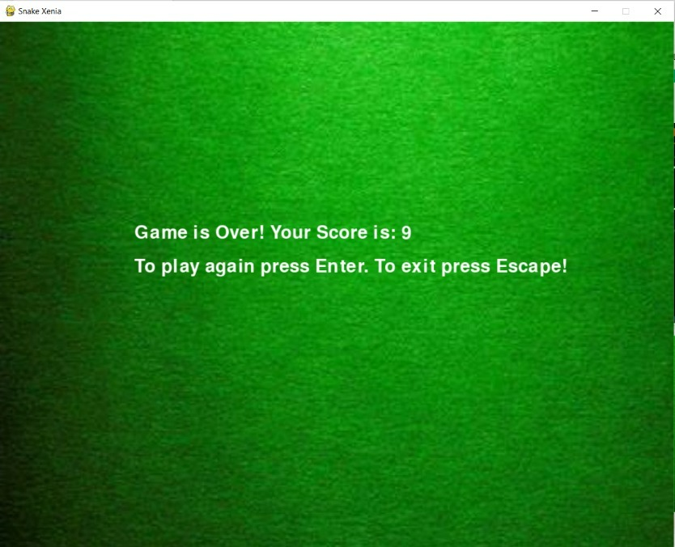

# Snake-Xenia
Famous snake xenia game built using Pygame library of Python.
Built the famous Snake Xenia game using Pygame library of Python.

Snake eats apple and grows in length. It increases the score by 1.
Avoid collision of snake's head with body/tail to continue in the game, else the game is over.

Use arrow keys to control the direction of the snake.

To play this game on your system- download the files and run the main 

**Thank You**

**Enjoy the Game!**
