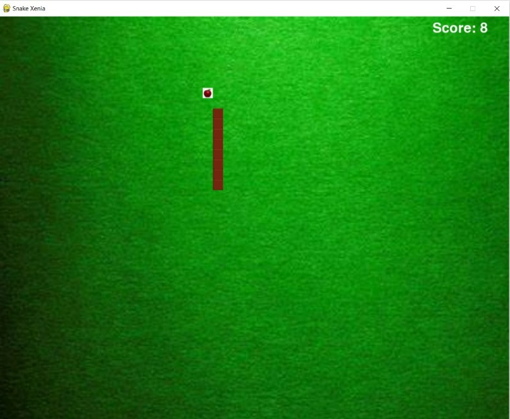

# Snake-Xenia
This is the famous snake xenia game built using **Pygame** library of **Python**.

Snake eats apple and grows in length. It increases the score by 1.
Avoid collision of snake's head with body/tail to continue in the game, else the game is over.

Use **arrow keys** to control the direction of the snake.

To play this game on your system- download the files and run the **game.py** file. Make sure you have installed a Python IDE on your system.
You can also run this game using code editors like VSCode,Atom,etc.

**Thank You**

**Enjoy the Game!**
